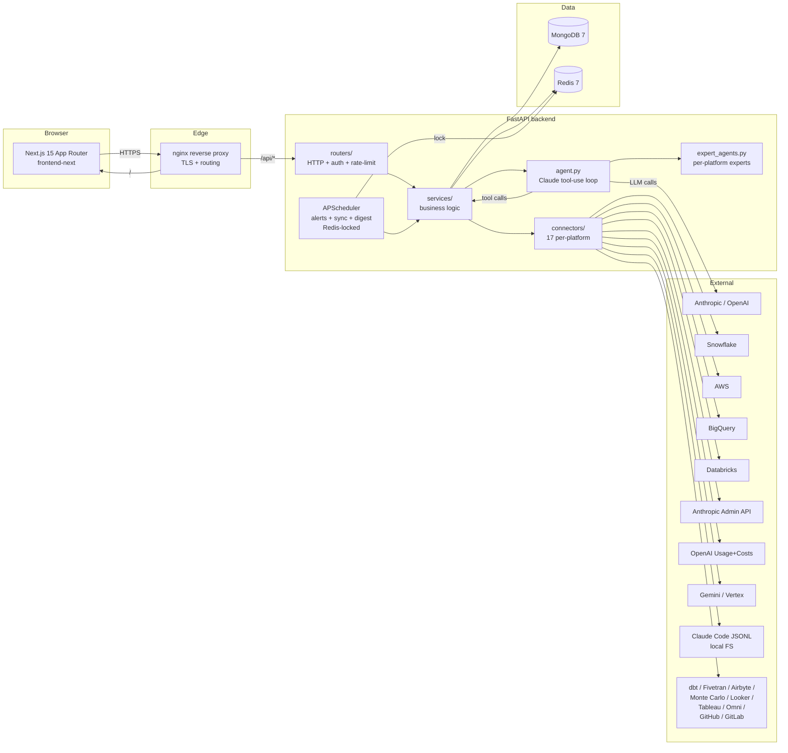

# Architecture

How Costly is put together. This document is the map you read before debugging a cross-module issue or adding a new feature.

> Scope: the OSS self-hosted build. The hosted edition layers on managed MongoDB, Let's Encrypt, a metrics stack, and a few proprietary connectors — but the core architecture below is unchanged.

---

## 1. One-paragraph summary

Costly is a Python (FastAPI) + Next.js app that queries 17 data / AI / BI / CI / cloud platforms with read-only credentials, normalises the result into a single `UnifiedCost` shape, and exposes (a) a dashboard, (b) an AI agent that answers cost questions with tool-use, and (c) alerting + anomaly detection. State lives in MongoDB; Redis caches hot reads and coordinates scheduler locks; credentials are Fernet-encrypted at rest.

---

## 2. High-level diagram



ASCII fallback:

```
Browser ──HTTPS──> nginx ──/api/*──> FastAPI routers ──> services ──> connectors ──> 17 external platforms
                      └──/───────> Next.js frontend                   │
                                                                      ├──> MongoDB (state)
                                                                      └──> Redis (cache + scheduler lock)
                                                        │
                                                        └──> agent.py (Claude tool-use) ──> LLM provider
```

---

## 3. Request lifecycle

### 3.1 Dashboard read (e.g. `GET /api/overview`)

1. Browser hits `/api/overview` with a bearer `access_token`.
2. nginx forwards to the backend.
3. `routers/*.py` resolves the route; `deps.get_current_user()` decodes the JWT, loads the user from MongoDB, and rejects if invalid / expired. A 401 triggers the Axios refresh interceptor on the frontend (`lib/api.ts`), which posts the refresh token to `/api/auth/refresh` and retries.
4. The router calls into `services/`. For cross-platform views, `services/unified_costs.py` iterates `CONNECTOR_MAP`, calls each registered connector's `fetch_costs()`, and normalises to `UnifiedCost`.
5. Results are cached in Redis keyed by `(user_id, view, date_range, filters)` with a TTL from `utils/constants.py:CACHE_TTL`. If Redis is unreachable, `services/cache.py` falls back to an in-memory TTL dict.
6. Response goes back through nginx to the browser. React components render via Recharts / shadcn tables.

### 3.2 AI agent question (e.g. chat in `/ai`)

1. Browser posts to `/api/chat/message` with a session id and the user's question.
2. `routers/chat.py` loads / creates the chat session in MongoDB (`chat_sessions.py`) and hands the conversation to `services/agent.py`.
3. `agent.py` runs a Claude (or OpenAI) tool-use loop. Tools are thin wrappers around `services/*` helpers — "get cost by platform", "get top workloads", "explain a spike", "list warehouses", etc. Platform-specific deep expertise is delegated to `services/expert_agents.py` (Snowflake Expert, AWS Expert, etc.), each of which consults its own knowledge base under `backend/app/knowledge/*.md`.
4. Tool results are appended to the conversation; the LLM produces a cited answer; streaming tokens are pushed back to the browser.
5. Persisted messages live in MongoDB so the UI can render the transcript on reload.

### 3.3 Scheduled jobs

`main.py` starts an `AsyncIOScheduler` on app startup. Every job wraps its body in a Redis `SETNX` lock so only one Uvicorn worker runs it per tick:

| Job | Cadence | Lock TTL | Body |
|-----|---------|----------|------|
| `evaluate_all_alerts` | 5 min | 5 min | Walk alerts, compare thresholds, send Slack / email. |
| `check_all_budgets` | 1 h | 1 h | Evaluate per-platform and org-wide budgets. |
| `sync_all_users_query_history` | 6 h | 6 h | Pull Snowflake `QUERY_HISTORY` into MongoDB. |
| `sync_all_platform_costs` | 1 h | 1 h | Run each platform connector and upsert to `unified_costs`. |
| `generate_and_store_all_digests` | daily | daily | Build the daily cost digest and email subscribers. |

Scheduler locks live in Redis so horizontal scale (multiple backend replicas) doesn't double-run. The in-memory cache fallback does not replace this lock — if Redis is down, scheduled jobs degrade to a single-worker deployment.

---

## 4. Module-by-module responsibilities

### `backend/app/main.py`

FastAPI app factory. Wires CORS, rate limiting (`slowapi`), routers, startup (index creation, scheduler start), and shutdown. The Redis-locked scheduler hooks live here.

### `backend/app/config.py`

Single `Settings` class (Pydantic). All env vars are read exactly once, at import. Anywhere that needs a setting imports `from app.config import settings`.

### `backend/app/database.py`

`AsyncIOMotorClient` setup + `create_indexes()` called on startup. Indexes on `users.email`, `connections.user_id`, `unified_costs.(user_id, platform, date)`, etc.

### `backend/app/deps.py`

FastAPI dependencies: `get_current_user()`, `get_data_source()` (switches between real platform data and demo data when the user has zero connections), `get_connection(platform)` (fetches + decrypts the user's credential for a platform).

### `backend/app/models/`

Pydantic request / response schemas. One file per domain (`auth.py`, `connection.py`, `alert.py`, `chat.py`, …). Used for both validation and OpenAPI docs.

### `backend/app/routers/`

Thin HTTP layer. Twenty-plus routers grouped by domain:

| Router | Purpose |
|--------|---------|
| `auth.py` | Register / login / Google OAuth / refresh / password reset. |
| `connections.py` | CRUD + test + activate platform credentials. |
| `platforms.py`, `platform_views.py` | List + per-platform drill-down. |
| `dashboard.py`, `overview`, `costs.py`, `ai_costs.py` | Aggregated dashboards. |
| `chat.py` | AI agent conversational API. |
| `anomalies.py`, `alerts.py`, `optimization.py`, `recommendations.py` | Insight surfaces. |
| `queries.py`, `storage.py`, `warehouses.py`, `workloads.py` | Snowflake-specific drill-downs. |
| `history.py` | Sync status + exports. |
| `public_demo.py` | Unauthenticated demo data. |
| `admin.py`, `debug.py`, `settings.py`, `teams.py` | Operator + account management. |

Routers never call external APIs directly — they call into `services/` or `services/connectors/`.

### `backend/app/services/`

Business logic. One concern per file.

| File | Concern |
|------|---------|
| `agent.py` | AI agent tool-use loop (Anthropic or OpenAI provider). |
| `expert_agents.py` | Per-platform expert agents with their own knowledge bases. |
| `unified_costs.py` | Cross-platform aggregation. Holds `CONNECTOR_MAP`. |
| `pricing.py` | Customer pricing overrides (capacity, EDP, committed-use discounts). |
| `anomaly_detector.py` | Z-score + DoD + WoW spike detection. |
| `budget_checker.py` | Budget evaluation. |
| `alerts_engine.py` | Alert evaluation + Slack / email dispatch. |
| `cost_sync.py` | Background job that runs every connector. |
| `query_sync.py` | Snowflake query-history sync. |
| `cost_digest.py` | Daily digest email builder. |
| `chat_sessions.py` | Chat session persistence. |
| `cache.py` | Redis-backed TTL cache with in-memory fallback. |
| `encryption.py` | Fernet encrypt / decrypt for stored credentials. |
| `email.py` | SMTP sender. |
| `slack.py` | Slack webhook sender. |
| `snowflake.py`, `snowflake_actions.py` | Direct Snowflake SQL (analytics + write-back actions: warehouse resize, auto-suspend tuning, clustering). |
| `demo.py`, `demo_platforms.py` | Demo-mode synthetic data generators. |

### `backend/app/services/connectors/`

One file per platform, all implementing the `BaseConnector` interface (`base.py`). Required methods: `test()`, `fetch_costs(start, end)`, and per-connector helpers. Every connector normalises to `UnifiedCost` records so `unified_costs.py` can aggregate without caring about the source.

The canonical data source, auth model, SKU taxonomy, and gotchas for each connector are documented under `docs/connectors/*.md` and the master spec `docs/connector-ground-truth.md`. Read those before editing a connector.

### `backend/app/knowledge/`

Markdown knowledge bases consumed by `expert_agents.py`. Each file is effectively a prompt — the expert agent inlines it as system context so the LLM answers with platform-specific rigour.

### `frontend-next/src/`

Next.js 15 App Router. Layout:

| Path | Purpose |
|------|---------|
| `app/layout.tsx` | Root layout: Inter font, Google OAuth provider, Auth provider. |
| `app/page.tsx` | Marketing landing page (SSR). |
| `app/setup/page.tsx` | Public multi-platform setup guide with deep-links into the in-app add flow. |
| `app/pricing/page.tsx` | Pricing. |
| `app/login/`, `app/reset-password/` | Auth pages. |
| `app/demo/page.tsx` | Logged-out demo that redirects into `/overview` with demo data. |
| `app/(dashboard)/*` | Authenticated route group — sidebar layout + auth guard. Contains `overview`, `dashboard`, `ai-costs`, `platforms`, `costs`, `queries`, `history`, `storage`, `warehouses`, `workloads`, `recommendations`, `alerts`, `settings`. |
| `components/ui/` | shadcn/ui primitives (copied in, not imported from a package). |
| `components/*` | Sidebar, date-range picker, stat cards, data-freshness badge, demo banner. |
| `lib/api.ts` | Axios client with JWT interceptors + auto-refresh. |
| `lib/format.ts` | `formatCurrency`, `formatBytes`, `formatDuration`. |
| `providers/auth-provider.tsx` | Auth context + token management. |
| `providers/date-range-provider.tsx` | Shared date-range state across dashboard pages. |

### `nginx/`

Reverse proxy config. `/api/*` → `backend:8000`, everything else → `frontend:3000`. TLS via mounted Let's Encrypt certs.

### `docker-compose.yml`

Five services: `mongodb`, `redis`, `backend`, `frontend`, `nginx`. All non-public ports bound to `127.0.0.1`. See `docs/deployment.md` for the `docker-compose.override.yml` pattern.

---

## 5. Data model (MongoDB collections)

| Collection | Shape | Indexes |
|------------|-------|---------|
| `users` | email, password_hash, google_sub, created_at | unique(email), unique(google_sub) |
| `connections` | user_id, platform, credentials (encrypted), active, last_sync | (user_id, platform) |
| `unified_costs` | user_id, platform, date, category, sku, amount_usd, tokens, cache_tier, metadata | (user_id, platform, date) |
| `alerts` | user_id, rule, threshold, channel, last_fired | (user_id) |
| `chat_sessions` | user_id, title, created_at | (user_id, created_at) |
| `chat_messages` | session_id, role, content, tool_calls, tool_results, created_at | (session_id, created_at) |
| `query_history` | user_id, query_id, warehouse, user, role, duration, credits, query_text | (user_id, start_time) |
| `digests` | user_id, period, content, sent_at | (user_id, period) |

All timestamps are stored as UTC datetimes. Currency is stored normalised to USD, with `metadata.currency` retained for the source amount where relevant.

---

## 6. Auth

- **Registration / login** — email + bcrypt password or Google OAuth (`@react-oauth/google` on the frontend, `/api/auth/google` on the backend).
- **Access tokens** — JWT, HS256, `JWT_SECRET` signing, **15 minute TTL**.
- **Refresh tokens** — JWT, HS256, **7 day TTL**. Frontend Axios interceptor auto-refreshes on 401 and retries the original request.
- **Password reset** — SMTP-delivered magic link keyed by a short-lived JWT.
- **Platform credentials** — stored in MongoDB, Fernet-encrypted with `ENCRYPTION_KEY`. Never logged. Decrypted only at connector `fetch_costs()` time.

---

## 7. Caching strategy

`services/cache.py` exposes a decorator + a get/set API. Keys are namespaced `(user_id, view, args_hash)`. TTLs live in `utils/constants.py:CACHE_TTL`:

| Read | TTL |
|------|-----|
| Dashboard aggregates | 5 min |
| Per-query details | 60 min |
| Warehouse list | 15 min |
| Per-platform cost series | 15 min |

If Redis is unreachable at startup or mid-request, writes / reads silently fall through to an in-memory TTL dict scoped to one Uvicorn worker. For multi-replica deployments this means cache misses across replicas but never correctness bugs. Put Redis back to recover shared-cache behaviour.

Cache invalidation:

- On `connection.activate()` / `connection.delete()` — flush the user's namespace.
- On `cost_sync` success — flush the user's platform namespace.
- Scheduled jobs read-through; they don't pre-warm.

---

## 8. Error model

Every router uses FastAPI `HTTPException` with the standard `{ "detail": "..." }` shape. Connector errors are typed (see `base.py:ConnectorError` and subclasses) so the UI can show actionable messages ("your Anthropic key is not an admin key", "AWS Cost Explorer permission missing") instead of raw stack traces.

Rate limiting is enforced by `slowapi` on sensitive routes (`/auth/*`, `/chat/*`). Exceeded limits return 429 with a `Retry-After` header.

---

## 9. Extending the system

### Adding a new connector

1. Create `backend/app/services/connectors/<platform>_connector.py` implementing `BaseConnector`.
2. Register in `CONNECTOR_MAP` in `services/unified_costs.py`.
3. Add the platform to `PLATFORM_KEYWORDS` in `services/expert_agents.py` so the agent routes questions to the right expert.
4. Add a knowledge base at `backend/app/knowledge/<platform>.md` for the expert agent.
5. Document the connector under `docs/connectors/<platform>.md` — follow the existing 10-section template from `connector-ground-truth.md`.
6. Add to the multi-platform setup guide at `frontend-next/src/app/setup/page.tsx` and the in-app add flow at `frontend-next/src/app/(dashboard)/platforms/page.tsx`.

### Adding a new dashboard page

1. `frontend-next/src/app/(dashboard)/<name>/page.tsx` — auto-gets sidebar + auth guard.
2. Add the nav link in `components/sidebar.tsx`.
3. If the page needs a new endpoint, add a router under `backend/app/routers/` and include it from `main.py`.

### Adding a new AI agent tool

1. Extend the tool registry in `services/agent.py` with a name, JSON schema, and a Python handler.
2. The handler should delegate to a `services/*` helper — never call external APIs directly from agent tool handlers.
3. Add a short description in the system prompt so the LLM knows when to use it.

---

## 10. Non-goals / known limitations

- **No Postgres support.** MongoDB was chosen because the data model (nested `metadata`, flexible `credentials` shapes, mixed-cardinality `unified_costs`) fits documents naturally. Not planning to migrate.
- **Single-tenant per deployment.** The data model supports per-user isolation but does not segregate by "org" or "workspace". Multi-tenant-SaaS features (org-admin, per-org billing, SSO) live behind a paid roadmap.
- **No streaming ingestion.** All connectors are pull-based; scheduled or on-demand. Push / webhook ingestion is not on the roadmap yet.
- **Tokenisation is list-price.** For subscription-based Claude Code / ChatGPT Pro users, computed dollars are an "imputed list-price" value, not invoice-authoritative. This is documented in the Claude Code KB and surfaced in the UI.

For the active roadmap, see `docs/connector-roadmap-2026.md`. For a current changelog, see `CHANGELOG.md`.
